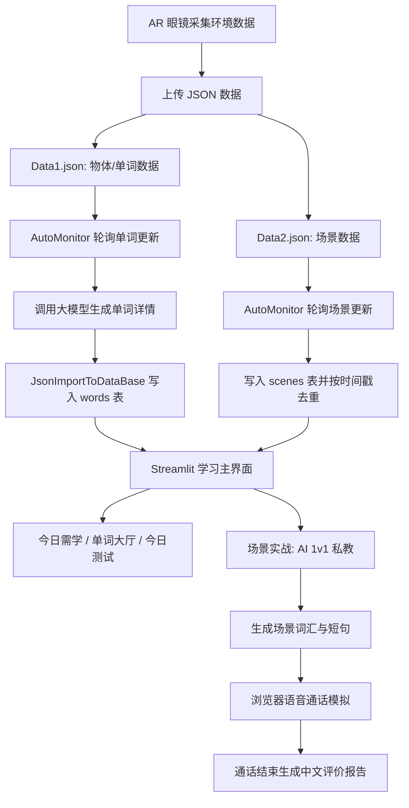

# 基于 AR 眼镜数据的英语学习系统工作流报告

## 1. 项目定位

本项目面向“利用 AR 眼镜进行情境化英语学习”的毕业设计方向。系统的核心思想是：AR 眼镜在用户真实环境中识别物体与场景，并将这些数据转化为个性化英语学习内容。当前代码已经形成了两条数据链路：

- 单词链路：AR 眼镜识别到物体或关键词后，系统调用大模型补全音标、释义、例句、词性、难度等学习信息，并写入本地词库。
- 场景链路：AR 眼镜识别到用户所处场景后，系统将场景保存到数据库，并在“场景实战”页面中生成该场景下的高频表达、实用短句和语音对话练习。

因此，该项目不是传统固定词表背诵工具，而是一个“环境感知 -> 内容生成 -> 复习测试 -> 场景口语实战”的个性化英语学习原型。

## 2. 总体工作流



从运行角度看，系统由三个部分协同工作：

1. `Receiver(1).py` 作为 Flask 接收端，提供 `/upload` 接口接收 AR 眼镜上传的 JSON。
2. `AutoMonitor.py` 作为后台监听器，持续轮询 `data/Data1.json` 与 `data/Data2.json`。
3. `app.py` 与 `scenario_learning.py` 作为 Streamlit 学习端，负责展示单词学习、复习测试和场景口语练习。

## 3. 数据采集与接入流程

AR 端上传的数据通过 `app_id` 区分来源。按照当前设计：

- `app1` 对应单词/物体数据，保存为 `Data1.json`。
- `app2` 对应场景数据，保存为 `Data2.json`。

样例单词数据包含 `words` 数组，每个元素包含 `english` 与 `chinese` 字段，并带有 `timestamp`。样例场景数据包含 `scene`、`app_id` 和 `timestamp`。

需要注意的是，当前接收端 `Receiver(1).py` 使用目录名 `Data`，而监听器 `AutoMonitor.py` 监听的是 `data` 目录。在 Windows 环境中大小写通常不敏感，因此当前项目可能仍能运行；但如果部署到 Linux 服务器，这会导致接收端写入目录与监听目录不一致。建议后续统一为同一个目录，并将路径配置集中管理。

## 4. 自动监听与数据处理流程

`AutoMonitor.py` 是项目的数据处理核心。它定义了两个独立监听目标：

- `WORD_JSON_FILE_PATH = data/Data1.json`
- `SCENE_JSON_FILE_PATH = data/Data2.json`

监听器每 1 秒检查一次 JSON 文件，并通过时间戳判断是否有新数据。

### 4.1 单词数据处理

当 `Data1.json` 的时间戳发生变化时，系统执行以下流程：

1. 读取 JSON 中的英文单词列表。
2. 对每个单词调用大模型，生成音标、中文释义、英文例句、例句中文翻译、词性和难度。
3. 将生成结果临时写入 `words_with_details.json`。
4. 调用 `JsonImportToDataBase.WordImporter` 导入 SQLite。
5. 如果单词已存在，则更新 `last_seen`、增加 `occurrence_count`，并将 `mastered` 重置为未掌握。
6. 如果单词不存在，则插入新记录。

该流程使词库能够反映用户最近在真实环境中反复遇到的词汇。`occurrence_count` 可以作为后续个性化推荐、重点复习或场景关联分析的依据。

### 4.2 场景数据处理

当 `Data2.json` 的时间戳发生变化时，系统读取 `scene` 字段并写入 `scenes` 表。表结构如下：

```sql
CREATE TABLE IF NOT EXISTS scenes (
    id INTEGER PRIMARY KEY AUTOINCREMENT,
    scene TEXT NOT NULL,
    source_app_id TEXT,
    source_timestamp INTEGER UNIQUE,
    created_at TIMESTAMP DEFAULT CURRENT_TIMESTAMP
)
```

其中 `source_timestamp` 设置为唯一值，用于避免监听器重启或重复读取时插入重复场景。空场景不会写入数据库。

## 5. 数据库设计

当前 SQLite 数据库 `vocabulary.db` 包含三张核心表：

| 表名 | 作用 |
| --- | --- |
| `words` | 保存单词、音标、释义、例句、难度、掌握状态、最近出现时间和出现次数 |
| `study_history` | 保存用户每次完成复习或测试的时间记录 |
| `scenes` | 保存 AR 眼镜识别到的真实场景 |

本次分析时，数据库中已有：

- `words`：5 条记录
- `study_history`：0 条记录
- `scenes`：2 条记录，分别为“咖啡厅”和“电影院”

这说明项目已经具备从 AR 场景进入数据库，再被学习界面读取的基础闭环。

## 6. 学习端功能流程

`app.py` 是 Streamlit 主界面，主要提供四个页面：

1. 今日需学
2. 单词大厅
3. 今日测试
4. 场景实战

### 6.1 今日需学

系统通过 `fetch_today_review_words()` 查询当天需要学习或复习的单词。当前复习规则基于 `last_seen` 与当前日期的间隔天数，筛选间隔为 `0、1、4、6` 天且未掌握的单词。这相当于一个简化版间隔重复机制。

用户可以浏览今日单词、查看释义、例句、词性、难度，并通过浏览器 Web Speech API 播放单词或例句发音。

### 6.2 单词大厅

单词大厅展示数据库中全部单词，支持前后切换、随机跳转、按编号跳转、标记掌握或取消掌握。它适合作为完整词库浏览和人工复习入口。

### 6.3 今日测试

今日测试从未掌握词中选取需要复习的单词，将单词部分字母遮挡，让用户根据中文释义和提示补全英文拼写。

答对后，系统会调用 `record_study_result()` 写入学习历史，并更新 `last_reviewed`。当间隔天数达到 6 天及以上时，系统会将该词标记为已掌握。答错时，系统展示正确拼写和例句，让用户重新记忆。

### 6.4 场景实战

场景实战由 `scenario_learning.py` 实现，是本项目与 AR 眼镜方向最贴合的功能模块。流程如下：

1. 页面打开时查询 `scenes` 表中当天保存的 AR 场景。
2. 如果当天存在场景，系统随机选择一个作为推荐练习场景。
3. 用户可以直接使用该 AR 场景生成练习内容，也可以随机切换另一个当天场景。
4. 如果当天没有 AR 场景，用户仍可手动输入场景，保证功能可用。
5. 系统调用大模型，为该场景生成 10 个高频词汇/词组和 10 个实用短句。
6. 用户可以分页学习这些表达，并播放英文发音。
7. 用户进入实时语音通话舱，与 AI 外教进行模拟对话。
8. 通话结束后，系统生成中文总结，包括综合评价、纠错优化和学习建议。

该模块的设计价值在于：用户不是背孤立单词，而是在“刚刚经历或正在经历的真实场景”中学习表达，符合情境学习和任务型语言学习的思路。

## 7. 模块职责划分

| 文件 | 主要职责 |
| --- | --- |
| `Receiver(1).py` | 提供 Flask 上传接口，接收 AR 端 JSON 数据 |
| `AutoMonitor.py` | 监听单词与场景 JSON，调用大模型，写入数据库 |
| `JsonImportToDataBase.py` | 将带详细信息的单词 JSON 导入 `words` 表 |
| `CreateDataBase.py` | 初始化 `words`、`study_history`、`scenes` 表 |
| `app.py` | Streamlit 主界面，负责词库浏览、今日学习、拼写测试、统计展示 |
| `scenario_learning.py` | 场景实战模块，负责 AR 场景推荐、表达生成、语音对话和总结报告 |
| `tests/test_scene_storage.py` | 测试场景表创建、场景写入去重、当天场景查询和监听处理 |

整体上，项目采用“接收端 + 后台监听器 + 本地数据库 + 学习前端”的轻量架构，适合毕业设计原型验证。

## 8. 当前验证结果

已执行以下验证：

```bash
python -m unittest tests.test_scene_storage -v
python -m py_compile AutoMonitor.py scenario_learning.py CreateDataBase.py JsonImportToDataBase.py "Receiver(1).py"
```

结果：

- 场景存储相关 5 个单元测试全部通过。
- 核心 Python 文件语法编译检查通过。

这说明当前场景数据存储与读取逻辑在测试层面是可用的。

## 9. 主要风险与改进建议

### 9.1 API Key 硬编码风险

当前大模型 API Key 直接写在 `AutoMonitor.py` 和 `scenario_learning.py` 中，并且 `render_voice_call_room()` 会把 API Key 嵌入前端 JavaScript。后者风险更高，因为浏览器端用户可以直接查看到密钥。

建议将密钥迁移到环境变量或 `.env` 文件，并将前端通话请求改为后端代理接口，避免把密钥暴露给客户端。

### 9.2 路径配置不统一

`app.py` 和 `scenario_learning.py` 使用绝对路径 `E:/Polyu/GraduateDesign/ProjectCode/vocabulary.db`，而 `AutoMonitor.py` 使用基于 `__file__` 的项目相对路径。接收端和监听端的数据目录大小写也不完全一致。

建议建立统一配置模块，例如 `config.py`，集中定义数据库路径、数据目录、时间戳文件和模型配置。

### 9.3 编码一致性需要检查

项目中的页面文案和样例 JSON 在当前控制台环境中存在中文显示异常的情况。虽然数据库中部分中文内容显示正常，但为了论文演示和跨平台运行，建议统一检查源文件和数据文件编码，确保均为 UTF-8。

### 9.4 大模型调用的稳定性

单词详情生成和场景表达生成都依赖外部模型服务。当前已有基本异常处理，但还可以进一步加入：

- 请求重试和超时控制
- 结果 JSON 结构校验
- 生成结果缓存
- 模型失败时的本地兜底内容

### 9.5 复习算法可以进一步增强

当前复习规则基于固定天数 `0、1、4、6`。后续可以结合用户答题结果、错误次数、出现频率和场景关联程度，设计更个性化的复习优先级。

## 10. 总结

本项目已经实现了一个清晰的 AR 英语学习闭环：AR 眼镜提供真实环境中的单词和场景数据，后台监听器将数据转化为结构化学习资源，Streamlit 前端提供词汇学习、复习测试和场景口语实战。尤其是 `scenes` 表与 `scenario_learning.py` 的结合，使系统从“看见物体学单词”进一步扩展到“进入真实场景练表达”。

从毕业设计角度看，项目的创新点可以概括为：基于 AR 感知数据的个性化词库构建、面向真实场景的英语表达生成、结合语音识别与语音合成的沉浸式口语模拟，以及可追踪的复习与掌握状态记录。后续若能解决密钥安全、路径配置、编码统一和模型调用稳定性问题，该系统将更适合作为完整演示原型和论文实验平台。
